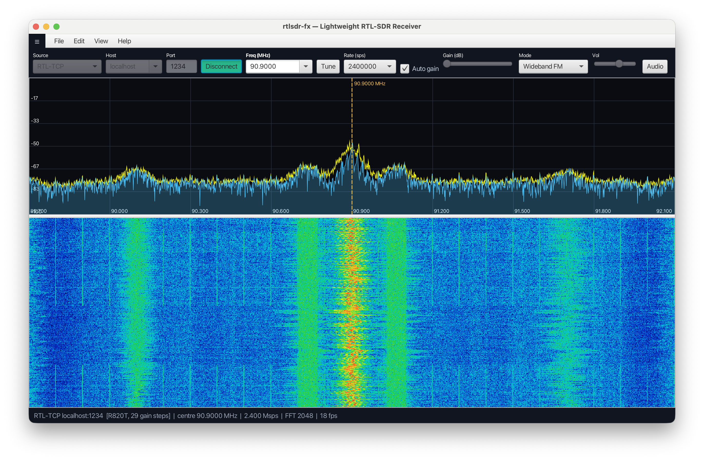

# rtlsdr-fx

A lightweight RTL-SDR receiver with live **spectrum** (waveform) and **waterfall** displays — a small, self-contained alternative to SDR++ built on **Spring Boot + JavaFX**.

It connects to a standard `rtl_tcp` server over TCP (no native libraries / no JNA), and also ships with a built-in **simulated source** so you can run and explore the whole UI with **no hardware at all**.



---

## Features

- **Spectrum view** — live FFT trace with filled area, dB + frequency grid, and a decaying peak-hold line.
- **Waterfall view** — scrolling time/frequency heat map with a classic
  black→blue→cyan→green→yellow→red→white color map.
- **Two signal sources**, switchable at runtime:
  - **RTL-TCP** — talks the `rtl_tcp` wire protocol to real hardware.
  - **Simulated** — synthetic IQ (two steady tones, one sweeping AM tone, plus
    complex Gaussian noise) for hardware-free demos and development.
- **Live tuning controls** — center frequency, sample rate, manual gain slider,
  and automatic gain.
- **Menu bar** — `File ▸ Exit`, `Edit ▸ Settings`, `Help ▸ About`.
  - **Settings** opens a modal dialog to choose the **spectrum trace** and
    **peak-hold** colors and pick the **waterfall palette** (Classic, Inferno,
    Ice, Green/CRT, Grayscale), with a live gradient preview. Changes apply
    immediately.
  - **About** shows the app name, version, copyright, MIT license, and a link to the GitHub repository.
- **Audio playback** — demodulates the tuned signal and plays it through your
  speakers, with selectable mode (**WFM** for broadcast FM, **NFM** for narrowband FM, **AM**), an on/off toggle, and a volume slider. The output is resampled to a fixed 48 kHz regardless of the device sample rate.
- **Pure-Java DSP** — radix-2 FFT, Hann window, fftshifted power-in-dB. No external DSP dependencies.

---

## Requirements

- **JDK 17+** (JavaFX is pulled in by Maven; no separate SDK install needed)
- **Maven 3.8+**
- For real hardware: an RTL-SDR dongle and the `rtl_tcp` tool from
  [librtlsdr](https://github.com/osmocom/rtl-sdr) (`rtl-sdr` package on most distros).

---

## Run it

### Simulated mode (no hardware)

```bash
mvn javafx:run
```

The app launches already configured for the **Simulated** source. Click **Connect** and you'll immediately see two stationary tones, a slow AM sweep moving across the band, and a noise floor underneath. This is the fastest way to see everything working.

A convenience wrapper is also included:

```bash
./run.sh
```

### Real RTL-SDR hardware

1. Plug in the dongle and start an `rtl_tcp` server (this ships with `rtl-sdr`):

   ```bash
   rtl_tcp -a 0.0.0.0 -p 1234
   ```

2. Launch the app (`mvn javafx:run`), then in the toolbar:
   - Set **Source** to `RTL-TCP`
   - Confirm **Host** / **Port** (defaults `127.0.0.1` / `1234`)
   - Enter a **Frequency** in MHz and pick a **Sample rate**
   - Click **Connect**

   Tune live with the frequency field + **Tune**, adjust the **Gain** slider, or enable **Auto gain**.

> If `rtl_tcp` runs on another machine, point **Host** at that machine's IP and make sure it was started with `-a 0.0.0.0`.

### Listening to audio

The signal at the **center** of the captured band is demodulated to audio (i.e. tune the dongle directly onto the station you want to hear):

1. Pick a **Mode** — `WFM` for broadcast FM (the default; the 100 MHz startup
   frequency is in the FM band), `NFM` for narrowband FM, or `AM`.
2. Click the **Audio** toggle to start playback, and use the **Vol** slider to set the level.
3. Tune to a station and **Connect**. For WFM, set the frequency to a strong local broadcaster (e.g. 88–108 MHz) and you should hear it.

Audio is decoded in pure Java: the IQ stream is low-pass filtered and decimated to a ~240 kHz IF, run through an FM phase discriminator (or AM envelope detector), filtered and decimated again to audio bandwidth, given 75 µs de-emphasis (WFM), and resampled to exactly 48 kHz for the sound card. The simulated source produces synthetic IQ, so it will make noise through the audio path but won't sound like a real station.

---

## How it's wired (architecture)

Spring Boot owns the **service/DI layer**; JavaFX owns the **GUI**. They're bridged with the well-known Josh Long pattern so a single process runs both:

```
SdrApplication.main
    └── Application.launch(JavaFxApplication)
            ├── init()   → boots the Spring context (headless=false)
            ├── start()  → publishes a StageReadyEvent
            └── MainController (@Component, @EventListener)
                    → builds the JavaFX UI on the FX thread
```

Data flow:

```
SignalSource (RtlTcpSource | SimulatedSource)
    │  raw interleaved IQ (float[])
    ▼
SdrService (@Service)
    │  ├─ audio path (every block): Demodulator → AudioPlayer (48 kHz out)
    │  └─ display path: SpectrumProcessor (Hann → FFT → |·|² → dB → fftshift),
    │       paced to ~targetFps; socket is always fully drained
    ▼
SpectrumFrame (record) ──► AtomicReference in MainController
                               │
                  AnimationTimer render loop
                       ├── SpectrumView.draw(frame)
                       └── WaterfallView.pushRow(frame)   (one row per new sequence)
```

Key packages under `org.tauasa.apps.sdr`:

| Package     | Responsibility                                                        |
|-------------|-----------------------------------------------------------------------|
| `dsp`       | FFT/windowing, decimating FIRs, and the `Demodulator` (WFM/NFM/AM).   |
| `audio`     | `AudioPlayer` — 16-bit PCM playback via `javax.sound.sampled`.        |
| `source`    | `SignalSource` interface, `RtlTcpSource`, `SimulatedSource`.          |
| `rtl`       | `rtl_tcp` protocol bits — `RtlCommand` opcodes, `TunerType`.          |
| `service`   | `SdrService` orchestration, `SpectrumFrame` data record.             |
| `ui`        | `MainController`, `SpectrumView`, `WaterfallView`, `Palette`.         |
| `config`    | `SdrProperties` (`@ConfigurationProperties("sdr")`).                  |

UI is built **programmatically** (no FXML) to keep the classpath simple, which
matters when Spring Boot and JavaFX share one classpath (no `module-info.java`).

---

## Configuration

Defaults live in `src/main/resources/application.yml` under the `sdr.*` prefix and map to `SdrProperties`:

```yaml
sdr:
  host: 127.0.0.1
  port: 1234
  fft-size: 4096
  sample-rate: 2400000
  center-frequency: 100000000
  gain-tenths-db: 200      # 20.0 dB
  auto-gain: false
  target-fps: 50
  waterfall-height: 300
  min-db: -100
  max-db: 0
  audio-enabled: false
  demod-mode: WFM          # WFM | NFM | AM
  volume: 0.6
```

Everything here is also adjustable live from the toolbar; these are just the
startup values.

---

## Notes

- A spike at the exact **center frequency** (DC) is normal for RTL-SDR — it's the tuner's DC offset, not a real signal.
- The simulated tones sit around **-12 dB** with a noise floor near **-56 dB**, which is why the default display window is **-100 .. 0 dB**.
- The `rtl_tcp` client casts the requested frequency to `int`; that's fine since the RTL-SDR tops out around 1.7 GHz, well under `Integer.MAX_VALUE`.

---

## License

MIT — see [LICENSE](LICENSE). Copyright (c) 2026 Tauasa Timoteo.
